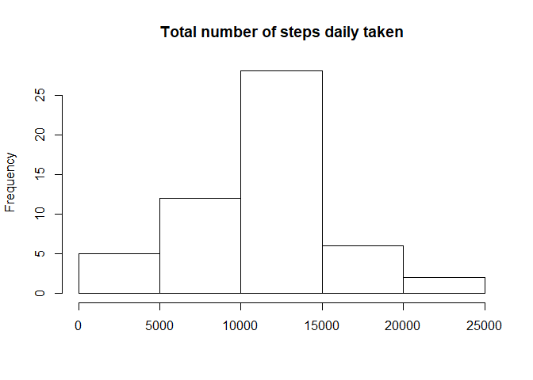
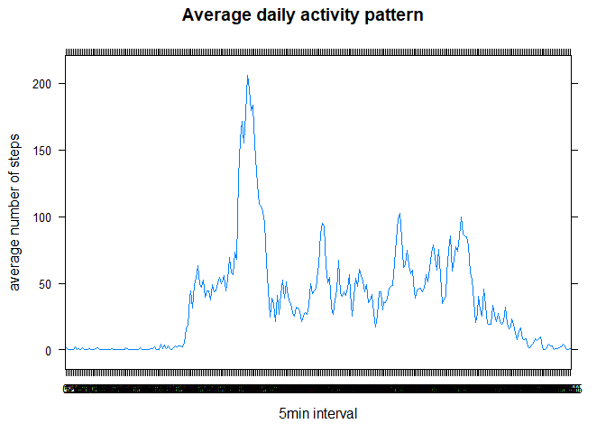
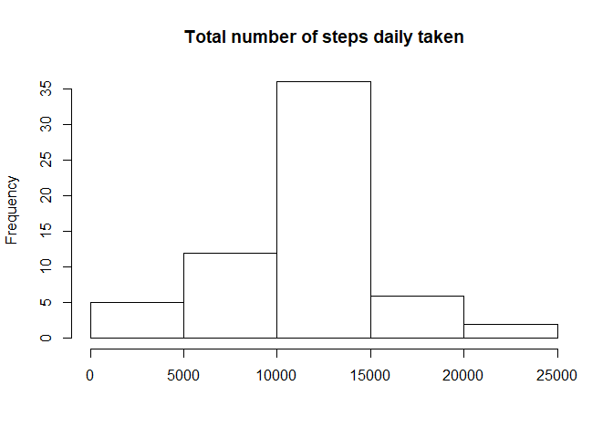
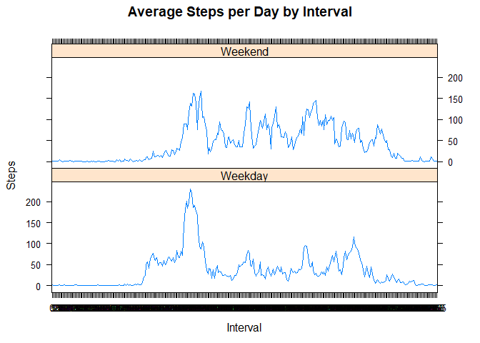

## Loading and preprocessing the data

```r
unzip("activity.zip")
activity <- read.csv("activity.csv", header=TRUE)
activity$date <- as.Date(activity$date, format = "%Y-%m-%d")
activity$interval <- as.factor(activity$interval)
```

## What is mean total number of steps taken per day?
Sum steps by day, create Histogram, and calculate mean and median.


```r
activity_sum <- aggregate(steps ~ date, activity, sum, na.rm=TRUE)
colnames(activity_sum) <- c("date","steps")

hist(activity_sum$steps, main="Total number of steps daily taken", xlab="")
```

<!-- -->

```r
mean(activity_sum$steps)
```

```
## [1] 10766.19
```

```r
median(activity_sum$steps)
```

```
## [1] 10765
```


## What is the average daily activity pattern?

To address this, a timeline plot of the activity over the day was made.
The maximum average number of steps was 206 in interval 835.


```r
library(dplyr)
```

```
## 
## Attaching package: 'dplyr'
```

```
## The following objects are masked from 'package:stats':
## 
##     filter, lag
```

```
## The following objects are masked from 'package:base':
## 
##     intersect, setdiff, setequal, union
```

```r
activity_av <- activity%>%
    group_by(interval) %>%
    summarise(av=mean(steps, na.rm=TRUE))

library(lattice)

xyplot(activity_av$av ~ activity_av$interval, main="Average daily activity pattern",xlab="5min interval", ylab="average number of steps", type="l")
```

<!-- -->

```r
activity_av[activity_av$av==max(activity_av$av),]
```

```
## # A tibble: 1 x 2
##   interval    av
##   <fct>    <dbl>
## 1 835       206.
```


## Imputing missing values

Missing data needed to be imputed. Missing values were imputed by inserting the average for each interval. The resulting histogram of total number of steps daily taken is quite similar to the histogram without imputed missing data.


```r
sum(is.na(activity))
```

```
## [1] 2304
```

```r
imputed_data <- transform(activity, steps = ifelse(is.na(activity$steps), activity_av$av[match(activity$interval, activity_av$interval)], activity$steps))

sum(is.na(imputed_data))
```

```
## [1] 0
```

```r
imputed_sum <- aggregate(steps ~ date, imputed_data, sum)
colnames(imputed_sum) <- c("date","steps")

hist(imputed_sum$steps, main="Total number of steps daily taken", xlab="")
```

<!-- -->

```r
mean(imputed_sum$steps)
```

```
## [1] 10766.19
```

```r
median(imputed_sum$steps)
```

```
## [1] 10766.19
```

Since the mean was taken to replace missing values, the overall mean hasn't changed. The median has slightly changed, it moved towards the mean.

## Are there differences in activity patterns between weekdays and weekends?

In the line plots, there is a clearer peak in activity on weekdays. A higher overall activity is observed in the weekend.


```r
weekdays <- c("maandag", "dinsdag", "woensdag", "donderdag", 
              "vrijdag")

imputed_data$dow = as.factor(ifelse(is.element(weekdays(as.Date(imputed_data$date)),weekdays), "Weekday", "Weekend"))

imputed_dow <- aggregate(steps ~ interval + dow, imputed_data, mean)

library(lattice)

xyplot(imputed_dow$steps ~ imputed_dow$interval|imputed_dow$dow, main="Average Steps per Day by Interval",xlab="Interval", ylab="Steps",layout=c(1,2), type="l")
```

<!-- -->

